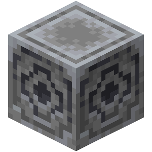
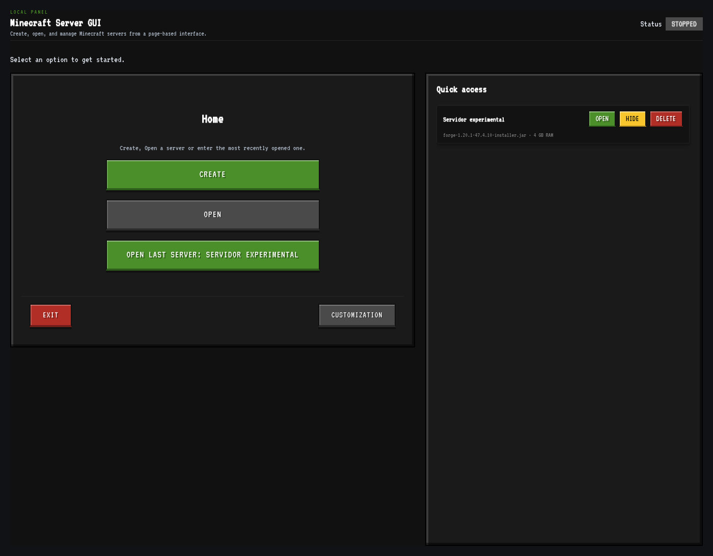

<div align="center">



# 🧭 Lodestone
### The Modern Minecraft Server Manager

**La forma más sencilla, visual y moderna de crear, configurar y gestionar servidores de Minecraft Java Edition locales.**

[](https://www.rust-lang.org/)
[](https://tauri.app/)
[](LICENSE)
[](#-requisitos-del-sistema)
[](https://minecraft.net/)

[Instalación Rápida](#-instalación-en-un-comando) •
[Características](#-características-principales) •
[Guía de Uso](#-guía-de-uso-para-el-usuario-final) •
[Motores Soportados](#-motores-de-servidor-soportados) •
[Compilación](#-compilación-y-desarrollo) •
[Licencia](#-licencia)

</div>

---

## ⚡ Instalación en un Comando (Linux Desktop)

Puedes clonar e instalar **Lodestone** directamente en tu menú de aplicaciones con este comando:

```bash
git clone https://github.com/lizarbe513/Lodestone-Minecraft-ServerManager.git && cd Lodestone-Minecraft-ServerManager && ./install.sh
```

> **¿Qué hace el instalador?**
> 1. Compila o copia el binario optimizado a `~/.local/bin/lodestone`.
> 2. Registra el icono oficial del bloque de Lodestone en tu sistema.
> 3. Genera el lanzador `lodestone.desktop` para que aparezca inmediatamente en tu lanzador de aplicaciones (Rofi, Wofi, GNOME, KDE, Hyprland, etc.).
> 4. Para desinstalarlo en cualquier momento: `./install.sh --uninstall`.

---

## 🌟 Características Principales

- 🚀 **Asistente de Creación y Descarga:** Descarga automáticamente los archivos necesarios para crear un servidor desde cero, o utiliza tus propios archivos `.jar`.
- 📁 **Acceso Rápido y Persistencia:** Guarda tus servidores en una lista de acceso rápido para encenderlos o gestionarlos con un solo clic.
- 💻 **Consola Interactiva en Tiempo Real:** Envía comandos directamente al servidor (`op`, `gamemode`, `stop`, `whitelist`, etc.) y visualiza los registros con resaltado de sintaxis.
- 🧠 **Diagnóstico Inteligente de Errores JVM:** Detecta automáticamente problemas frecuentes al iniciar el servidor (versión de Java incompatible, falta de memoria RAM asignada o puertos TCP ya ocupados).
- 🧩 **Gestión de Complementos y Mods:** Administra plugins, mods (con soporte para Modrinth `.mrpack`) y datapacks fácilmente desde una interfaz visual.
- 🗺️ **Gestión y Respaldo de Mundos:** Cambia el mundo activo, renombra, importa archivos `.zip` o crea copias de seguridad completas de tu servidor.
- 🎨 **Personalización y Multilenguaje:** Soporte completo en Español e Inglés, selector de temas y paletas visuales personalizadas.

---

## 📸 Capturas de Pantalla

<div align="center">
  
  <p><em>Panel principal: acceso directo a servidores guardados, creación rápida y personalización.</em></p>
</div>

---

## 📖 Guía de Uso para el Usuario Final

### 1. Iniciar o Crear un Nuevo Servidor
1. En la pantalla principal, pulsa sobre **`CREAR`**.
2. Selecciona la opción que prefieras:
   - **Descargar motor automáticamente:** Elige el software (Vanilla, Paper, Purpur, Fabric, Forge, NeoForge) y la versión de Minecraft deseada.
   - **Archivo `.jar` existente:** Si ya tienes el ejecutable descargado en tu ordenador, selecciónalo directamente.
3. Elige el directorio donde se ubicarán los archivos del servidor y asígnale un nombre descriptivo.
4. Ajusta la memoria RAM en GB (ej. `4 GB`) y selecciona la versión de Java adecuada.
5. Pulsa **`Iniciar Servidor`**. La aplicación preparará el entorno, generará el script de arranque (`start.sh` en Linux o `start.bat` en Windows) y comenzará el proceso.

### 2. Aceptar el Acuerdo de Licencia (EULA)
La primera vez que arranques cualquier servidor oficial de Minecraft, se pausará solicitando la aceptación del EULA de Mojang:
- Lodestone detectará el estado automáticamente y te mostrará un botón para **Aceptar EULA y Reiniciar** con un solo clic sin necesidad de editar archivos manualmente.

### 3. Abrir un Servidor Ya Existente
1. En la pantalla principal, pulsa sobre **`ABRIR`**.
2. Selecciona la carpeta donde reside tu servidor de Minecraft existente.
3. La aplicación detectará automáticamente el archivo `.jar` principal, la configuración de arranque y los mundos disponibles.

### 4. Administrar el Servidor en Ejecución
- **Terminal:** Utiliza la barra de entrada inferior para ejecutar comandos de servidor (`op <jugador>`, `whitelist add <jugador>`, `time set day`, etc.).
- **Monitor de Recursos:** Observa el consumo de memoria RAM y el estado del servidor en tiempo real.
- **Configuración y Propiedades:** Modifica propiedades como `server-port`, `motd`, `difficulty` o `max-players` directamente desde la pestaña de propiedades.

---

## ⚙️ Motores de Servidor Soportados

| Motor | Tipo | Soporte en App |
| :--- | :--- | :---: |
| **Vanilla** | Oficial Mojang | ✅ Completo |
| **PaperMC** | Servidor optimizado / Plugins | ✅ Completo (API Paper v3) |
| **Purpur** | Alto rendimiento / Plugins | ✅ Completo (API PurpurMC) |
| **Fabric** | Servidor ligero para Mods | ✅ Completo (API Fabric Meta) |
| **Forge** | Servidor para Mods | ✅ Completo (Instalador Forge) |
| **NeoForge** | Nueva generación de Mods | ✅ Completo (Maven NeoForged) |

---

## 🛡️ Seguridad Integrada

- **Protección Anti Zip-Slip (Path Traversal):** Todas las operaciones de extracción (mundos `.zip`, modpacks `.mrpack` o restauraciones de respaldos) validan estrictamente las rutas relativas para evitar vulnerabilidades en el sistema de archivos.
- **Sanitización de Rutas:** Protección ante secuencias de escape de directorios (`..`) en la edición y lectura de archivos de configuración.
- **Inspección de Puertos:** Verificación previa de puertos de red para advertir de colisiones antes de ejecutar el servidor.

---

## 💻 Requisitos del Sistema

- **Sistema Operativo:** Linux (Ubuntu/Debian, Arch/Omarchy, Fedora), Windows 10/11, o macOS.
- **Java Runtime Environment (JRE / JDK):**
  - **Java 21:** Recomendado para Minecraft 1.20.5 en adelante.
  - **Java 17:** Recomendado para Minecraft 1.18 a 1.20.4.
  - **Java 8:** Requerido para versiones antiguas (Minecraft 1.12.2 o anteriores).
- **Librerías gráficas (sólo en Linux):**
  - GTK 3 y WebKit2GTK (generalmente preinstaladas en la mayoría de distribuciones).
  - En Arch Linux: `sudo pacman -S webkit2gtk gst-plugins-good`

---

## 🛠️ Compilación y Desarrollo

Si deseas compilar la aplicación desde el código fuente o contribuir al desarrollo:

### 1. Clonar el Repositorio
```bash
git clone https://github.com/lizarbe513/Lodestone-Minecraft-ServerManager.git
cd Lodestone-Minecraft-ServerManager
```

### 2. Requisitos de Desarrollo
- [Rust & Cargo](https://rustup.rs/) (v1.75+)
- [Tauri CLI](https://tauri.app/start/):
  ```bash
  # En Arch Linux:
  sudo pacman -S cargo-tauri

  # O mediante Cargo:
  cargo install tauri-cli --version "^2"
  ```

### 3. Ejecutar en Modo Desarrollo
```bash
cargo tauri dev
```

### 4. Ejecutar Pruebas Automatizadas
```bash
cargo test --manifest-path src-tauri/Cargo.toml
```

### 5. Compilar Binario de Producción (Release)
```bash
cargo tauri build
```
El instalador empaquetado o binario generado se ubicará en `src-tauri/target/release/`.

---

## 📄 Licencia

Este proyecto está distribuido bajo la licencia **GNU General Public License v3.0 (GPL-3.0)**, la misma licencia de software libre adoptada por proyectos como **Prism Launcher**. Consulta el archivo [LICENSE](LICENSE) para más detalles.

---

<div align="center">
  Desarrollado por <strong>lizarbe513</strong> y <strong>Norditeon</strong>
</div>
